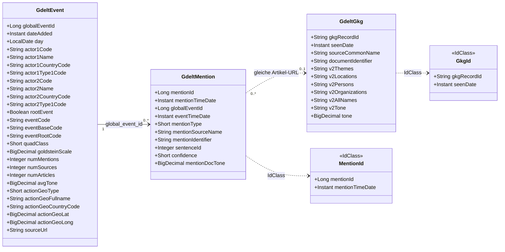

# Datenmodell — lucoris-pulse

Verbindliche Quelle des Schemas ist die Flyway-V1-Migration (aus `lucoris_gdelt_schema.sql`).
Dieses Dokument erklärt Aufbau und Begründung. Bei Änderungen: hier UND in `decisions.md` nachziehen.

## Fünf Schichten
- A ROH:      GDELT-Original 1:1 (gdelt_events, gdelt_mentions, gdelt_gkg) — Fidelity/Resale/
             Reprocessing. Die semikolon-Rohlisten (Themen/Orgs/...) leben NUR hier.
- B ABFRAGE:  article — Artikel-Hub, dedupliziert pro URL.
- C ENTITÄT:  theme / location / organization / person + article_* Link-Tabellen (per FK).
             KEINE Trennzeichen-Listen mehr — alles ausmodelliert.
- D AUFLÖSUNG: company (verweist auf organization), portfolio, portfolio_holding.
- E SIGNAL:   event_significance, theme_volume_daily.

## Die drei GDELT-Rohdatensätze (Schicht A)
GDELT (Global Database of Events, Language, and Tone) liefert je 15-Min-Slice drei Dateien:
- EVENTS (gdelt_events): ereignis-zentriert. Ein CAMEO-kodiertes Akteur–Aktion–Akteur-Ereignis je
  Zeile, global eindeutig über global_event_id. Beantwortet „WAS ist passiert".
- MENTIONS (gdelt_mentions): je Erwähnung eines Events in einem Artikel eine Zeile (Event 1:N),
  verbindet Ereignis und Artikel-URL (mention_identifier).
- GKG (gdelt_gkg): GKG = "Global Knowledge Graph". ARTIKEL-/dokument-zentriert — eine Zeile je von
  GDELT verarbeitetem Artikel (gkg_record_id, Quelle, document_identifier = URL). Beantwortet
  „WORUM geht es im Artikel": extrahierte Themen (V2Themes), Personen, Organisationen, Orte, Tonwert
  und Namen als semikolon-getrennte Rohlisten. KEINE global_event_id (nicht ereignisgebunden).
  Primärdatensatz für Lucoris: die Themen steuern Marktrelevanz-Filter und Entitäts-Auflösung; die
  Rohlisten leben nur hier und werden beim Ingest in Schicht C aufgelöst. Brücke zur Ereignis-Welt
  über die URL (mentions.mention_identifier = gkg.document_identifier).

## Klassendiagramm: beim Ingest geschriebene Entities
Beim Einlesen schreibt der Firehose ausschließlich die drei Roh-Entities der Schicht A
(`GdeltEvent`, `GdeltMention`, `GdeltGkg`) plus ihre `@IdClass`-Schlüsselklassen. Die aufgelösten
Schichten (Article, Theme, Location, Organization, Person …) werden beim Ingest NICHT geschrieben
(kein Resolver implementiert); `IngestLog` (Dedup-Ledger) existiert, wird aber vom aktuellen Ingest
noch nicht befüllt.

Schlüssel & Verknüpfungen (Legende zum Diagramm):
- GdeltEvent: PK = `globalEventId` (natürlich, von GDELT vergeben, KEINE Sequence); nicht partitioniert.
- GdeltMention: PK = (`mentionId`, `mentionTimeDate`); `mentionId` aus `mention_seq`,
  `mentionTimeDate` = Partitionsschlüssel; `@IdClass(MentionId)`.
- GdeltGkg: PK = (`gkgRecordId`, `seenDate`); `seenDate` = Partitionsschlüssel; `@IdClass(GkgId)`.
- Die Verknüpfungen sind LOGISCH (keine DB-Fremdschlüssel, unabhängig geladen): Event 1:N Mention
  über `global_event_id`; Mention → GKG über die Artikel-URL (`mention_identifier` =
  `document_identifier`). GKG hat KEINE `global_event_id`.

## Die vier Entitätstypen (unterschiedliche Kanonizität — Kernentscheidung)
- THEMA:  GDELT-Themencode ist bereits kanonisch -> theme.theme_code als PK, kein Resolver.
- ORT:    geokodiert (FeatureID/FIPS/ADM1/LatLong) -> Auflösung beim Ingest über Geo-Felder.
- ORG:    roher NER-Text, KEIN GDELT-Identifikator -> Surrogat + organization_alias-Resolver.
- PERSON: wie ORG (Namensgleichheit gefährlicher -> konservativ auflösen, im Zweifel nicht mergen).
Gleiches Muster (Entität + Artikel-FK), typ-spezifischer Schlüssel. String-Matching passiert
EINMAL beim Ingest, nie bei der Suche (Suchen laufen über Integer-FKs).

## Company vs. Organization
Nicht jede Organisation ist ein Wertpapier (Behörden, NGOs, Notenbanken). company verweist per
FK auf organization. Portfolio-Recall: portfolio_holding -> company -> article_organization ->
article, rein über organization_id, ohne Laufzeit-String-Matching. Aliasse braucht nur der Ingest.
Ticker->Firmenname-Mapping (inkl. Aliasse, Kollisionsschutz via is_ambiguous) wird gepflegt.

## Schlüssel (Sequenzen, batch-optimiert)
Alle surrogaten IDs über Sequenzen mit INCREMENT 50 (mention_seq, article_seq, location_seq,
organization_seq, person_seq, company_seq, portfolio_seq). Entities: @SequenceGenerator(
allocationSize = 50), pooled-lo. Grund: IDENTITY verhindert JDBC-Batching am Firehose.

## Partitionierung
article, gdelt_mentions, gdelt_gkg sind monatlich RANGE-partitioniert (Zeitfenster-Queries +
Retention per Partition-Drop). Zusammengesetzter PK (id, seen_date) macht die FKs der Link-
Tabellen partitionierungssicher; seen_date ist in die Link-Tabellen denormalisiert, damit
24h-Filter über den Index prunen. Partitions-Rollover per pg_partman/Cron, NICHT in Migrationen.

## Signifikanz
event_significance.significance_score ist eine GENERATED-Spalte (gewichtete Mischung aus
Coverage-Menge, Domain-/Länder-Diversität, spike_ratio, Goldstein-Intensität). Der Ingest-Job
füllt die Metrik-Spalten; spike_ratio kommt aus dem Vergleich mit theme_volume_daily (Baseline).
Die Gewichte sind tunebar — das ist die editoriale Logik ("Zusammenhänge erkennen"), der Moat.

## Ereignis-Klammer
"Ein Ereignis, alle Quellen" hält GDELT über global_event_id (Events 1 : N Mentions). GKG hat
KEINE global_event_id (artikel-zentriert, verbunden über gemeinsame Themen/Entitäten). Brücke:
mentions.mention_identifier = gkg.document_identifier (URL). Dedup nicht nur über ID (GDELT hat
~20% Redundanz) — near-duplicate Events zusätzlich zusammenführen.
